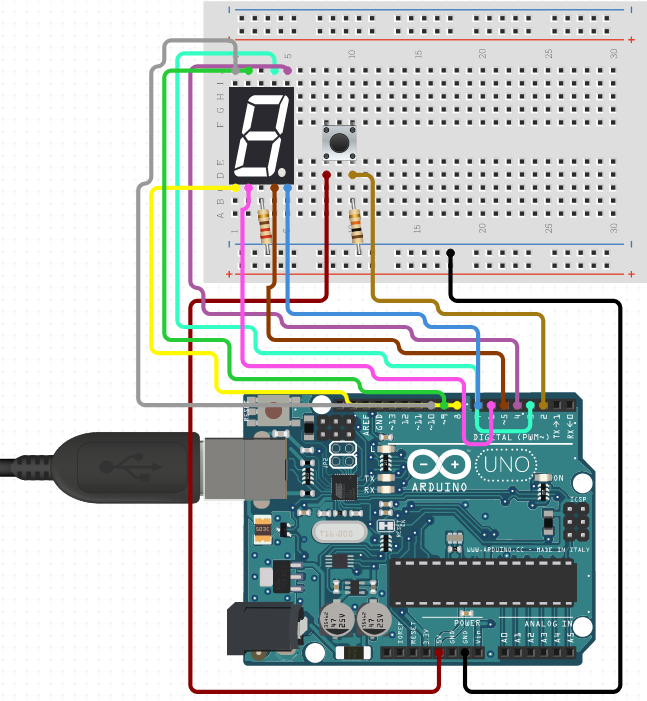
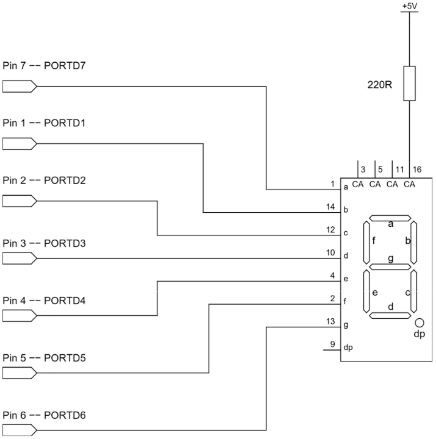
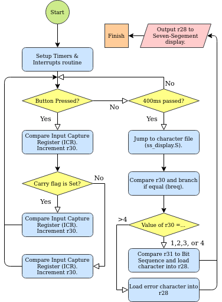

# avr-morse-decoder
A morse decoder programmed for a `AT-mega328p` chip and run using an `Arduino Uno Rev3`.  
  
It works by detecting input from a button, then decoding and outputting the corresponding morse code letter  
  
## Content
 * [How To Run?](#How-To-Run?)
   - [Requirements](#Requirements)
   - [Development Tools](#Development-Tools)
 * [Design](#Design)
   - [Flow-Chart Concept](#Flow-Chart-Concept)
   - [Overview of Implementation](#Overview-of-Implementation)
   - [Challenges of Implementation](#Challenges-of-Implementation)

## How to Run
You will need an `Arduino Uno Rev3` with a seven-segment display and a button setup in the flowwing configuration:  

  
Here is the pin configuration for the `seven segment` display  

  
Once in the correct configuration connect the Arduino to your computer via USB.  
Open a terminal to navigate to the `src` directory.  
Compile and upload the program using the command `make upload`  
  
Test everything worked by using the button on the Arduino.  
  
### Requirements
 * `Arduino Uno Rev3`
 * `make`
  
### Devlopment Tools
 * AVR Assembler
 * Arduino Uno Rev3
 * Emacs
  
## Design
  
### Flow-Chart Concept
  

  
### Overview of Implementation
  
The decoder works by using two registers for input (r30 & r31). Each time a button press is detected r31 will be incremented, so pressing the button three times will mean r31 has the value 3. For each button press the Input Capture Register will be compared against 200ms, determining a dot or dash. For both a dot or dash input r30 is logically shifted left however adash input will also increment r30. Once 400ms have passed with no input there is a jump to the ss_display.s file where r31 will be compared for the number of presses, then branch to compare r30 to the correct bit sequence and branch again to output a character to the display. Then the routine runs again.  
Morse codes of length 3 and below can be decoded: A, D, E, G, I, K, M, N, O, R, S, T, U, W.  
  
The encoder works by loading the message into table as a null terminated string. Using theinstruction lo8 and hi8, we load the message into the Z register, after this we loop throughmessage and put the current value into r24 and compare it against the alphabet, when the correct letter is found the offset into the table is then used by the table of morse code values to offset the the correct point in the alphabet. Then the code is translated from the binary code outlined in the assignment brief to a series of timed blinks that make up the morse code.  
  
### Challenges of Implementation
  
The first challenge was developing the Timers and Interrupts. When testing theimplementation the Arduino was able to detect the falling and rising edge but only for the first button press, in addition it would only display the character for a very short duration. Debugging this issue was the hardest challenge but the solution was found, the Input Capture Registers, Timer Control Register and several other timers and interrupts where mis-configured or within the wrong label.  
  
The second challenge for the decoder came when comparing the 4 length morse codes, due tothe implementation of loading the characters r28, comparing r30, and branching if equal, the relative distance was too far for the Arduino to pinpoint. To fix the issue a direct jump (jmp) was going to be used for all 4 length codes as the Arduino could pinpoint the location however, by the time of the demonstration we had not implemented the fix.  
